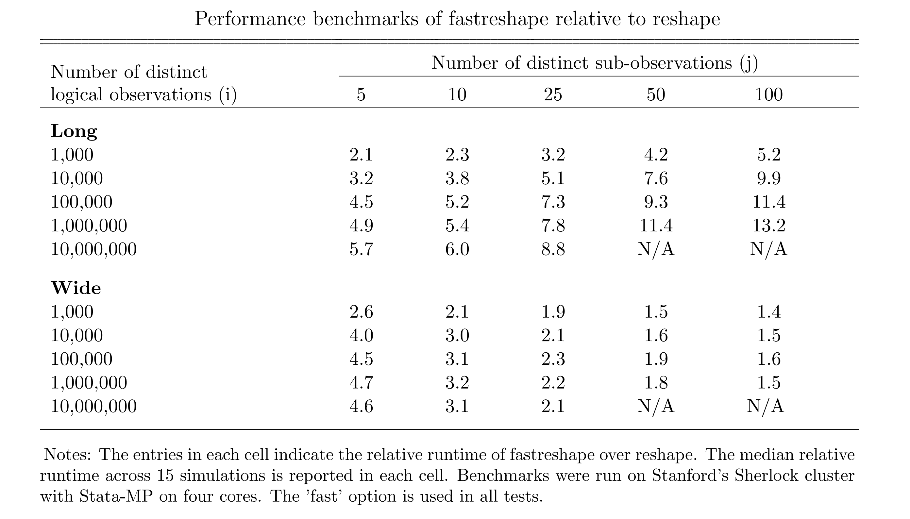

fastreshape
=================================

[Overview](#overview)
| [Installation](#installation)
| [Usage](#usage)
| [Benchmarks](#benchmarks)
| [To-Do](#todo)
| [Acknowledgements](#acknowledgements)
| [License](#license)

More efficient implementation of reshape in Stata

`version 0.2 17jan2018`


Overview
---------------------------------

Fastreshape is an efficient implementation of the reshape procedure in Stata.

Although the default reshape program in Stata is incredibly useful for working with panel data, it is known to perform poorly on large datasets (see [this benchmark](https://github.com/matthieugomez/benchmark-stata-r) 
and [this discussion](https://www.statalist.org/forums/forum/general-stata-discussion/general/1338350-making-reshape-faster/)).

Fastreshape runs several times faster than reshape in most use cases. 
As described in the [benchmarks](#benchmarks) section below, wide-to-long reshapes are between 2 and 15 times faster with fastreshape, with the largest improvements when the dataset is big. 
Similarly, long-to-wide reshapes are between 1.5 and 5 times faster with fastreshape, particularly when the number of logical observations (indexed by i) is large relative to the number of sub-observations (indexed by j).

Although fastreshape was built from scratch, usage and output are deliberately structured to be virtually identical to reshape.

Installation
---------------------------------

There are two options for installing fastreshape. The program is not yet available on SSC.

1. The most recent version can be installed from Github with the following Stata commands:

```stata
local github "https://raw.githubusercontent.com"
net install fastreshape, from(`github'/mdroste/stata-fastreshape/master/)
```

2. A ZIP containing the program can be downloaded and manually placed on the user's adopath.


Usage
---------------------------------

The syntax, usage, and data output of fastreshape is virtually identical to reshape, with a few exceptions:

1. Fastreshape does not support subsetting the sub-observation variables (j) with a list of values (e.g. specifying j(year 2001 2003 2004)). This can easily be done prior to reshape with a keep command, so it is a low priority.
2. Fastreshape does not support highlighting problem observations with the fastreshape error command ex post. Support for this functionality may be included at a later date, but is not viewed as particularly important at this time.
3. Fastreshape does not support the atwl(char) argument. Use the @ character instead. Support for this functionality is a low priority (see todo).

Notably, there is now an optional argument called -fast-. The default behavior of fastreshape is to sort the dataset by i and j for fastreshape long,
 and to sort the dataset by i for fastreshape wide, which matches exactly the output produced by reshape. In many cases, however, there is no reason for sorting on these variables. The fast option omits this sorting step and therefore speeds up runtime by a significant amount.

 Documentation for fastreshape can be accessed within Stata:
```stata
help fastreshape
```

Usage notes on the reshaping procedure can be found in the documentation for reshape:
```stata
help reshape
```

Benchmarks
---------------------------------




  
Todo
---------------------------------

The following items will be addressed soon:

- [x] Return additional information in scalars with optional argument.
- [x] Support for implicit reshape syntax for repeated reshapes.
- [ ] Return more informative error dialogue.
- [ ] Support for the atwl(char) argument.

A port of this program in C would yield a significant increase in performance; I have no plans to do that in the near future.


Acknowledgements
---------------------------------

This program was inspired by [this Statalist discussion](https://www.statalist.org/forums/forum/general-stata-discussion/general/1338350-making-reshape-faster/) provided by Robert Picard, Daniel Feenberg, and Paul Von Hippel.


License
---------------------------------

fastreshape is [MIT-licensed](https://github.com/mdroste/stata-fastreshape/blob/master/LICENSE).

